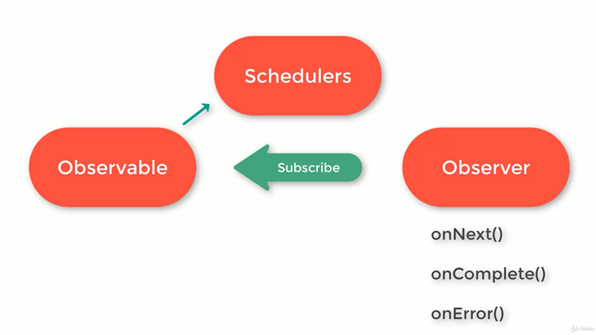
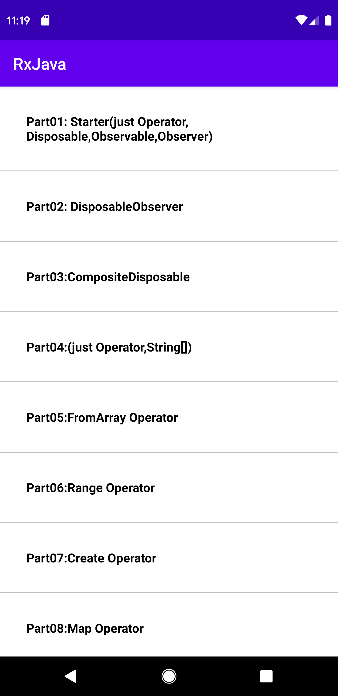
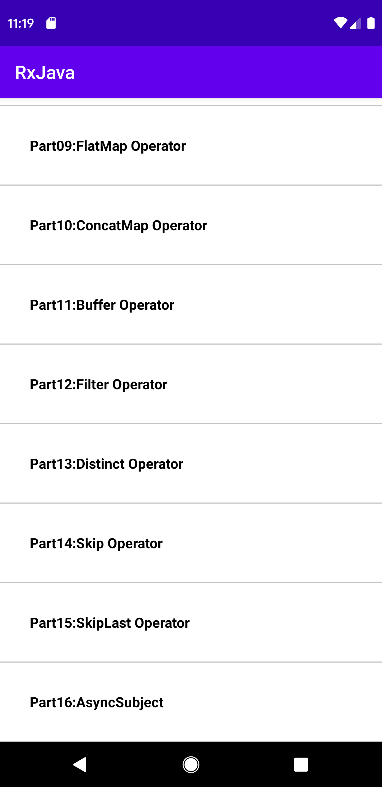
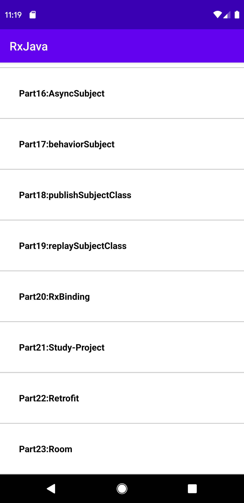

# android-RxJava-simple-practice
this is a practice with all the details,which what is rxJava,what is Observable and....

# developed by Mahdi Razzaghi Ghaleh
RxJava simple practice by JAVA android

# What is Reactive Programming?
In Reactive Programming the consumer code blocks react to the data as it comes in.

# What is ReactiveX?
ReactiveX is a project which provides implementation for this reactive programming concept for different programming languages.

# Reactive Extentions = ReactiveX

# What is the difference between RxJava and RxAndroid?
RxAndroid is just a layer on top of RxJava which provides android specific support.

# Observable&Observer
RxJava always has two main constructs:  Observable and Observer;
Observables are the main thing.Observables are where we get data.To observe observables we have Observers;
Observables: Instance of Observable Class,They emit data.
Observer:Instance of Observer Interface they consume data emited by the Observable.
One Observable can have many observers.
Observer usually has 3 main methods:onNext(), onCompleted() and onError().

Between Observables and Observers there are Schedulers.To handle multithreading nicely we have schedulers.

Schedulers basically decides the thread on which a particular code runs whether on background thread

# Operators
Operators allow you to convert the stream before its received by the observers and also they allow you to chain multiple operators.
there are over 70 different operators available.
We can use them to control data streams belong to observables in any specific way we want.

# Disposable, CompositeDisposable & DisposableObserver
DisposableObserver: DisposableObserver is a much efficient way, it reduces the number of code line and it makes our works easier,especially if you have more than one observers in a class.
CompositeDisposable: in one class you can have more than one observables (each observable can have many observers), so in case like that you will have many observers to dispose.When we have more than one observers we use CompositeDisposable.

we use them to avoid memory leaks.one set Observable and Observer connection is called a subscription.

# What are the schedulers in RxJava?
with help of Schedulers we handle multithreading in RxJava.
A schedulers can be identified as a thread pool managing one more threads.

# we have different types of schedulers:
Schedulers.io(): This can have a limitless thread pool.Used for non CPU intensive tasks.Such as database interaction, network communications and file system interactions.
AndroidSchedulers.mainThread(): This is where usr interaction happen. This is the main thread/UI thread.This scheduler does not come with RxJava, Provided to RxJava from RxAndroid.
*In Android development 90% of the time we use these 2 schedulers:Schedulers.io(), AndroidSchedulers.mainThread()*
Schedulers.newThread(): This schedulers creates a new thread for each unit of work scheduled.
Schedulers.single(): This schedulers has a single thread executing tasks one after another following the given order.
Schedulers.trampoline(): this scheduler executes tasks following first in first out basics, We use this when implementing recurring tasks.
Schedulers.from(Executor executor): This creates and returns a custom scheduler backed by a specific executer.

# Should we use RxJava with Retrofit ?
if you are working with a large amount of data which also need some modifications, or if you have to communicate with multiple REST APIs simultaneously RxJava is the best say to do it.

# What are the benifits of using RxJava with Retrofit?
To get the advantage of operators
To avoid multithreading problems
To avoid memory leaks
Easier error handling
To write cleaner code

# Subject
A Subject is a sort of bridge or proxy that is available in some implementations of ReactiveX that acts both as an observer and as an Observable.
Because it is an observer, it can subscribe to one or more Observables, and because it is an Observable, it can pass through the items it observes by reemitting them, and it can also emit new items.
Subject class extending the Observable class and implementing the Observer interface. That's why it can act like both.
# when do we use subjects?
Subjects have a lots of "real world" applications. When you transform your code base from imperative to reactive style. It can serve as a bridge between those two coding style.
# Subject type
Async Subject:it emits only the last value of the Observable.
Behavior Subject:it emits most recently emitted item and all the subsequent items of the source Observable.
Publish Subject:it emits all the subsequent items of the source Observable at the time of subscription.
Reply Subject:it emits all the items if the source Observable, regardless of when the subscriber subscribes.

