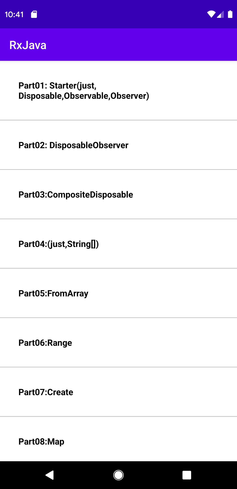
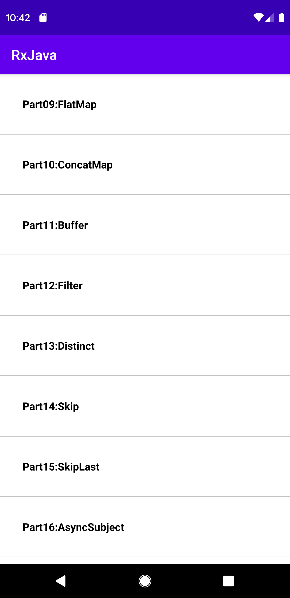

# android-RxJava-simple-practice
this is a practice with all the details,which what is rxJava,what is Observable and....

# developed by Mahdi Razzaghi Ghaleh
RxJava simple practice by JAVA android

# What is Reactive Programming?
In Reactive Programming the consumer code blocks react to the data as it comes in.

# What is ReactiveX?
ReactiveX is a project which provides implementation for this reactive programming concept for different programming languages.

# Reactive Extentions = ReactiveX

# What is the difference between RxJava and RxAndroid?
RxAndroid is just a layer on top of RxJava which provides android specific support.

# Observable&Observer
RxJava always has two main constructs:  Observable and Observer;
Observables are the main thing.Observables are where we get data.To observe observables we have Observers;
Observables: Instance of Observable Class,They emit data.
Observer:Instance of Observer Interface they consume data emited by the Observable.
One Observable can have many observers.
Observer usually has 3 main methods:onNext(), onCompleted() and onError().

Between Observables and Observers there are Schedulers.To handle multithreading nicely we have schedulers.

Schedulers basically decides the thread on which a particular code runs whether on background thread

# Operators
Operators allow you to convert the stream before its received by the observers and also they allow you to chain multiple operators.
there are over 70 different operators available.
We can use them to control data streams belong to observables in any specific way we want.

# Disposable&CompositeDisposable
we use them to avoid memory leaks.one set Observable and Observer connection is called a subscription.

